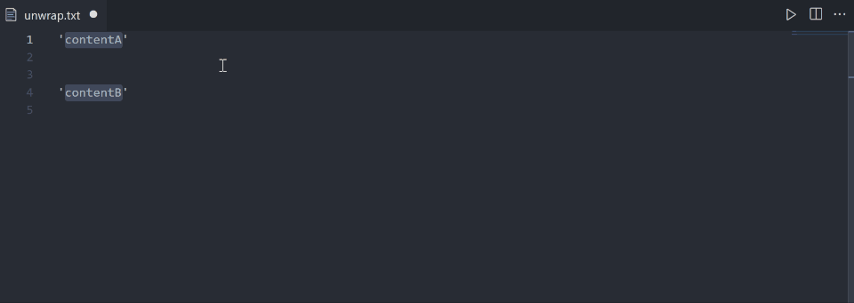
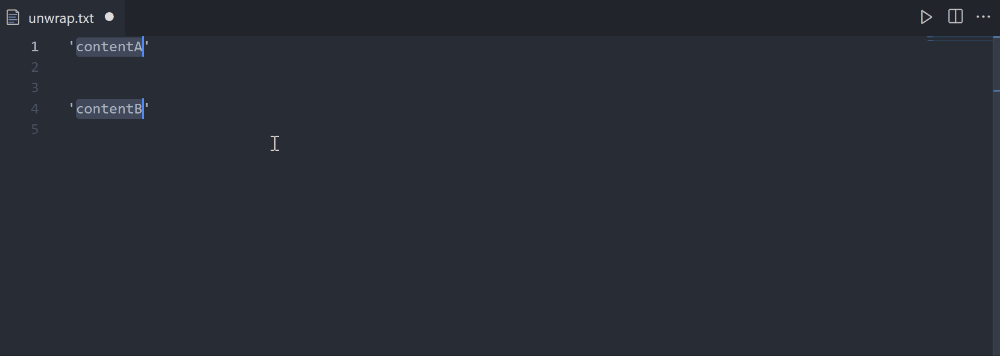

# vscode-unwrap
Unwrap selection in [Visual Studio Code](https://github.com/Microsoft/vscode).

## How it works

### Using the command palette

### Using a keyboard shortcut

The default keboard shortcut is set to `alt+u`, but you can change it to something else by overriding the `key` value of the `unwrap.toUnwrap` command.

## License
MIT
